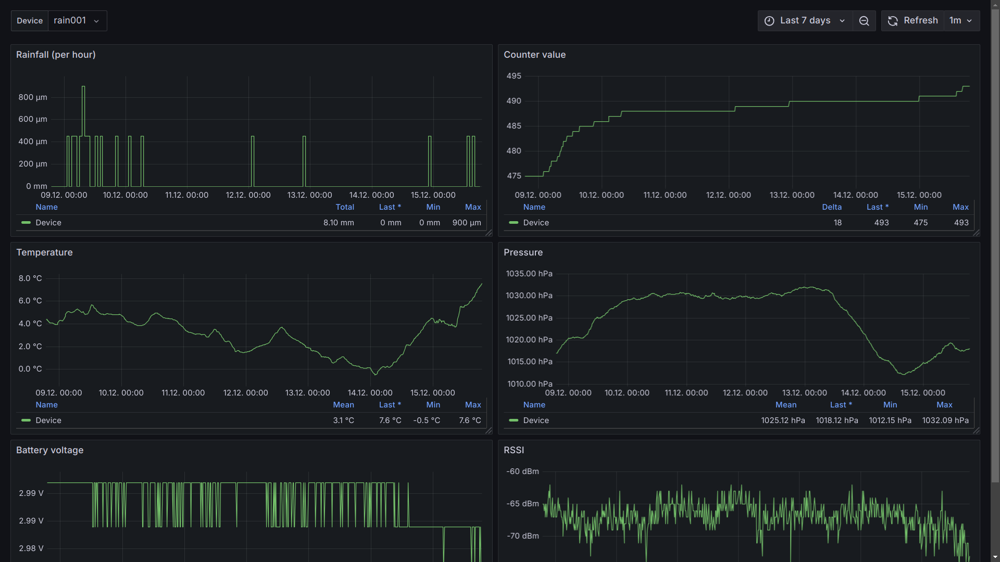

# Docker Telegraf-InfluxDB-Grafana stack

This repository contains a [Docker Compose](https://docs.docker.com/compose/) setup for a [Telegraf](https://docs.influxdata.com/telegraf/v1/)-[InfluxDB](https://docs.influxdata.com/influxdb/v1/)-[Grafana](https://grafana.com/docs/grafana/latest/) stack, [including dashboards](https://grafana.com/docs/grafana/latest/administration/provisioning/) for my [IoT Geiger Counter](https://github.com/MalteP/iotgeiger-lora) and [LoRa Rain Gauge](https://github.com/MalteP/lora-raingauge) project. Data is fetched from [TTN](https://www.thethingsnetwork.org/) via [MQTT](https://www.thethingsindustries.com/docs/integrations/mqtt/). The setup is meant as an example how easy measurement data can be visualized while testing the projects.

## Prerequisites

In [The Things Stack console](https://console.cloud.thethings.network/), the application should already be added, the corresponding payload decoder configured and at least one node registered. Afterwards, an MQTT integration is added. Make a note of the host, user name and password somewhere, as it will be needed later.

Furthermore, a computer with Debian Linux is required. This can be a virtual machine or a Raspberry Pi, for example.

## Installation

Make sure to run the following commands as root user (possibly use ``sudo su`` to change).

As a requirement we need Docker, Docker Compose and git packages.

    apt-get update
    apt-get install docker docker-compose git

I suggest installing docker applications to /opt/docker. Let's first create the directory and then clone our git repository.

    mkdir /opt/docker
    cd /opt/docker

    git clone https://github.com/MalteP/docker-tig-stack.git

Now we need to configure the environment variables which will be used to create the configuration files for the stack. First copy the example file to config.env and then use your favorite editor to fill in the MQTT data for your connection to The Things Network application server.

    cp config.env.example config.env
    
    vi config.env

Note that the MQTT topic also contains the username. Also note that the Application *must* contain "geiger" or "rain" because there is a device selection inside the Grafana dashboards which uses a regex to filter. But you might also modify that, of course.

### Adding more MQTT connections

Only one MQTT connection is needed for each LoRa application. The data of all nodes is published there. If you want to use two applications (i.e. Geiger Counter and Rain Gauge) in parallel, uncomment the second block and add both MQTT credentials and activate the second configuration template.

    cp telegraf/telegraf.d/mqtt_consumer02.conf.example telegraf/telegraf.d/mqtt_consumer02.conf

### Runing the stack

To create and run the containers, use Docker Compose (as root user and within the /opt/docker/docker-tig-stack directory, of course).

    docker-compose up -d

The setup can be verified as follows:

    docker container ls

If something had gone wrong verify the logs:

    docker-compose logs

And to destroy the containers you might use:

    docker compose down

All user data is stored permanently within docker volumes. You may view them as follows:

    docker volume ls

## Usage

With all containers up and running, simply open a browser and navigate to http://127.0.0.1:3000/ or whatever IP address your computer can be reached on the network.

Grafana might ask you to change the default password (if you did not already change the lines in the environment file before deployment). From the menu on the upper right side, select dashboards and open the dashboard.

Now enjoy your data!

## License

As this repository mainly consists of configuration files for the various software components which were taken from the respective documentation, i've chosen [The Unlicense](https://unlicense.org/) to release it into the public domain.
